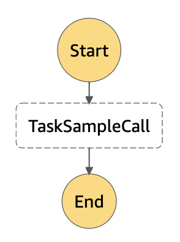
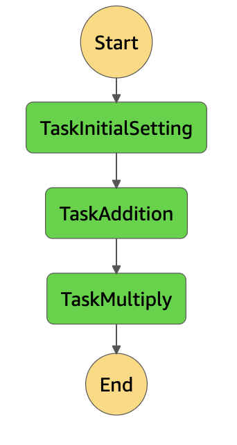
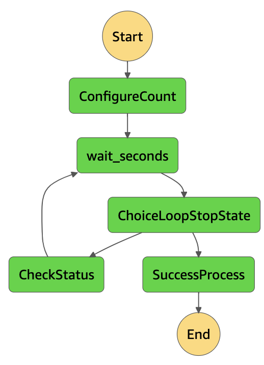

# AWS Step Functions

視覚的なワークフローを使用して、分散アプリケーションとマイクロサービスのコンポーネントを調整できるウェブサービス

下記、記事を参考して動かしてみた

- Step Functionsを使って初めてループや分岐をやってみた！
https://dev.classmethod.jp/cloud/aws/first-aws-step-functions/


## ステートマシンの定義

### ステートマシン例1

```
{
  # ステートマシンの説明（コンソールには表示されない？）
  "Comment": "Sample AWS Step functions flow",
  # 一番最初に実行される状態
  "StartAt": "TaskSampleCall",
  # 各状態をこの配下に記載していく
  "States": {
    # 状態名
    "TaskSampleCall": {
      # 状態の説明(コンソールには表示されない)
      "Comment": "SampleCallの呼び出し",
      # 状態のタイプ(作業、分岐、遅延など)
      "Type": "Task",
      # 実行するARNを指定する
      "Resource": "arn:aws:lambda:ap-northeast-1:(AWSユーザーID):function:SampleCall",
      # Lambda関数へパラメータとして渡すデータを定義。これによって、Lambda内のeventにて値を取得可能
      "InputPath": "$",
      # Lambda関数からのreturn値を定義
      "ResultPath": "$.SampleCallResult",
      # Step Functionsで次のステートへ渡したいデータを定義
      "OutputPath": "$",
      # trueが設定されていると実行が終了される
      "End": true
    }
  }
}
```

### ステートマシン例2


```
{
    "Comment": "Sample Calculation flow",
    "StartAt": "TaskInitialSetting",
    "States": {
        "TaskInitialSetting": {
            "Comment": "初期の値を設定します",
            "Type": "Task",
            "Resource": "arn:aws:lambda:ap-northeast-1:(AWSユーザーID):function:SampleSetting",
            "InputPath": "$",
            "ResultPath": "$.SettingResult",
            "OutputPath": "$",
            "Next": "TaskAddition"
        },
        "TaskAddition": {
            "Comment": "足し算をおこないます",
            "Type": "Task",
            "Resource": "arn:aws:lambda:ap-northeast-1:(AWSユーザーID):function:SampleAddition",
            "InputPath": "$",
            "ResultPath": "$.AdditionResult",
            "OutputPath": "$",
            "Next": "TaskMultiply"
        },
        "TaskMultiply": {
            "Comment": "掛け算をおこないます",
            "Type": "Task",
            "Resource": "arn:aws:lambda:ap-northeast-1:(AWSユーザーID):function:SampleMultiply",
            "InputPath": "$",
            "ResultPath": "$.MultiplyResult",
            "OutputPath": "$",
            "End": true
        }
    }
}
```

アウトプット
ResultPathに指定したオブジェクトに結果が入る。`$`は一番上位のオブジェクト
```
{
    "Comment": "Insert your JSON here",
    "SettingResult": {
        "foo": 1
    },
    "AdditionResult": {
        "var": 3
    },
    "MultiplyResult": {
        "baz": 9
    }
}
```

### ステートマシン例3


```
{
    "Comment": "Sample loop flow",
    "StartAt": "ConfigureCount",
    "States": {
        "ConfigureCount": {
            "Type": "Pass",
            # 次の状態に渡される結果。Lambda内のreturnの中身のイメージ
            "Result": {
                "idx": 1,
                "step": 1,
                "maxcount": 3,
                "continue": true
            },
            "ResultPath": "$.iterator",
            "Next": "wait_seconds"
        },
        "wait_seconds": {
            "Type": "Wait",
            # ５秒待つ
            "Seconds": 5,
            "Next": "ChoiceLoopStopState"
        },
        "ChoiceLoopStopState": {
            "Type": "Choice",
            "Choices": [{
                "Comment": "ループ継続フラグcontinueをチェックする",
                "Variable": "$.iterator.continue",
                "BooleanEquals": true,
                "Next": "CheckStatus"
            }],
            "Default": "SuccessProcess"
        },
        "CheckStatus": {
            "Type": "Task",
            "Resource": "arn:aws:lambda:ap-northeast-1:(AWSユーザーID):function:SampleCountUp",
            "InputPath": "$",
            "ResultPath": "$.iterator",
            "OutputPath": "$",
            "Next": "wait_seconds"
        },
        "SuccessProcess": {
            "Type": "Succeed"
        }
    }
}
```

## 参考URL
- AWS Step Functions とは
https://docs.aws.amazon.com/ja_jp/step-functions/latest/dg/welcome.html
